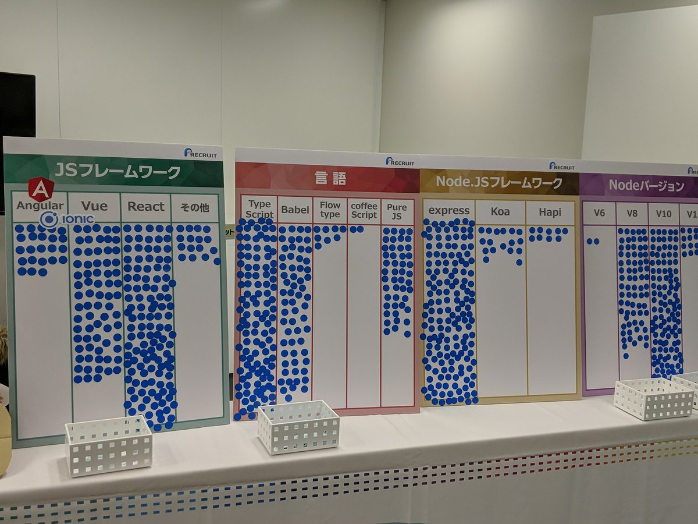
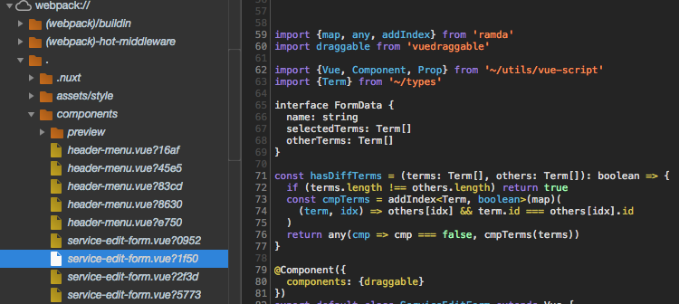
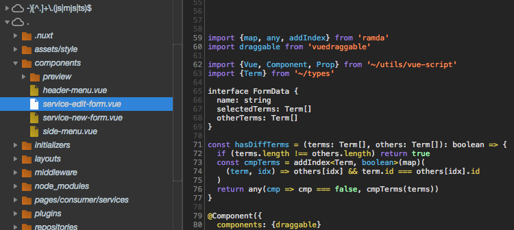

autoscale: true
slidenumbers: true
footer: NuxtMeetup #6
Theme: Business Class,5

[.slidenumbers: false]
[.hide-footer]
# NuxtとTSと私
## in NuxtMeetup #6


---

# About me


- [@iwata](https://github.com/iwata)
	- 熊本出身
- Software Engineer
	- 株式会社エスエムエス(約1年半)
- Vue歴約4年
	- Nuxt歴7ヶ月:beginner:
	- TypeScript歴2ヶ月:beginner::beginner:
- Editor: Vim(NeoVim)
- Terminal: [Alacritty](https://github.com/jwilm/alacritty)

---

# [fit] よろしくお願いします:innocent: 


---

# Agenda

- TypeScript編
	- Module for `ts-loader`
	- Improve Source Map
	- Testing about Middleware
- SSR編
	- GoogleAppEngine SE Node
	- Demo

---

```
＿人人人人人人人人人人＿
＞　突然の質問タイム　＜
￣Y^Y^Y^Y^Y^Y^Y^Y^Y￣
```

---

# Nuxt使ってる人:raising_hand: 


---

# TypeScript使ってる人:raising_hand:
	


---

# ですよねぇ…:sweat_smile:

---

[とあるHTML5 Conferrence](https://twitter.com/__sakito__/status/1066851267455025152)



---

# TypeScriptやってみたい人:raising_hand:
	


---

# SSRしてる人:raising_hand:
	


---

# SSRやってみたい人:raising_hand:
	


---

# Agenda(再掲)

- TypeScript編[^1]
	- Module for `ts-loader`
	- Improve Source Map
	- Testing about Middleware
- SSR環境編
	- GoogleAppEngine StandardEnviroment Node
	- Demo

[^1]: [UIT#5](https://slides.com/iwatamotonori/uit5)で話さなかったこと

---

# `ts-loader`の設定

- こちらを参考にするとよい
	- [https://github.com/nuxt-community/typescript-template](https://github.com/nuxt-community/typescript-template)
- `~/modules/typescript.js`などを用意して`ts-loader`の設定を書く
	- `nuxt.config.js`の`modules`に追記
- Nuxtの[example](https://github.com/nuxt/nuxt.js/tree/dev/examples/typescript)だと動かない
	- SFCで`lang=ts`が使えない

---

`~/modules/typescript.js`

```ts
module.exports = function() {
  this.nuxt.options.extensions.push("ts")
  this.extendBuild(config => {
    const tsLoader = {
      loader: "ts-loader",
      options: {appendTsSuffixTo: [/\.vue$/]}
    }
    config.module.rules.push({
      test: /((client|server)\.js)|(\.tsx?)$/
      ...tsLoader
    })
    for (let rule of config.module.rules) {
      if (rule.loader === "vue-loader") {
        rule.options.loaders.ts = tsLoader
      }
    }
    if (config.resolve.extensions.indexOf(".ts") === -1) {
      config.resolve.extensions.push(".ts")
    }
  })
}
```

---

# `ts-loader`遅い問題

- [fork-ts-checker-webpack-plugin](https://github.com/Realytics/fork-ts-checker-webpack-plugin)
	- TSのtype checkerを別プロセスで実行してくれる
- [awesome-typescript-loader](https://github.com/s-panferov/awesome-typescript-loader)もあるけど`.vue`には使えないらしい
	- [Something like "appendTsSuffixTo" for Vuejs · Issue \#356 · s\-panferov/awesome\-typescript\-loader](https://github.com/s-panferov/awesome-typescript-loader/issues/356)

---

`fork-ts-checker-webpack-plugin`版 `~/modules/typescript.js`

[.code-highlight: all]
[.code-highlight: 8,21-24]
```ts
module.exports = function() {
  this.nuxt.options.extensions.push('ts')
  this.extendBuild(config => {
    const tsLoader = {
      loader: 'ts-loader',
      options: {
        appendTsSuffixTo: [/\.vue$/],
        transpileOnly: true
      }
    }
    config.module.rules.push({
      test: /((client|server)\.js)|(\.tsx?)$/,
      ...tsLoader
    })
    for (const rule of config.module.rules) {
      if (rule.loader === 'vue-loader')
        rule.options.loaders.ts = tsLoader
    }
    if (config.resolve.extensions.indexOf('.ts') === -1)
      config.resolve.extensions.push('.ts')
    const ForkTsCheckerWebpackPlugin = require('fork-ts-checker-webpack-plugin')
    config.plugins.push(
      new ForkTsCheckerWebpackPlugin({workers: 2, vue: true})	// workersは注意
    )
  })
}
```

^ recommendedのworkers=ForkTsCheckerWebpackPlugin.TWO_CPUS_FREEだとCircleCIでOOM

---

# `build.cache`

- `nuxt.config.js`で`build.cache=true`するとより速くなる
	- [https://nuxtjs.org/api/configuration-build#cache](https://nuxtjs.org/api/configuration-build#cache)
	- `node_modules/.cache`以下にcacheが作られる
- たまにcacheのせいでエラーになるので以下を`package.json`に定義しておくと便利

```javascript
{
	"scripts": {
		"clear-cache": "rimraf node_modules/.cache"
	}
}
```

---

# nuxt buildの実測値[^2]

| lang | fork-ts-checker | build.cache | client(ms) | server(ms) | total(min) |
| ------------ | ------------- | ------------- | ------------- | ------------- | ------------- |
| JS | - | false | 26491 | 5903 | 0.54 |
| JS | - | true | 17009 | 5445 | 0.37 |
| TS | disable | false | 135198 | 82301 | 3.62 |
| TS | disable | true | 98351 | 77254 | 2.93 |
| TS | enable | false | 32077 | 10651 | 0.71 |
| TS | enable | true | 12784 | 12456 | 0.42 |

[^2]: 計測時のNuxtだと`nuxt`では実行時間出力してくれなかったがv2.3からは`nuxt`でも出力される

^ Dual Core i5 MBP13

---

# SFCのSourceMap

```ts
<script lang="ts">
import {map, any, addIndex} from 'ramda'
import draggable from 'vuedraggable'
import {Vue, Component, Prop} from '~/utils/vue-script'
import {Term} from '~/types'
interface FormData {
  name: string
  selectedTerms: Term[]
  otherTerms: Term[]
}
const hasDiffTerms = (terms: Term[], others: Term[]): boolean => {
  if (terms.length !== others.length) return true
  const cmpTerms = addIndex<Term, boolean>(map)(
    (term, idx) => others[idx] && term.id === others[idx].id
  )
  return any(cmp => cmp === false, cmpTerms(terms))
}
@Component({
  components: {draggable}
})
export default class ServiceEditForm extends Vue {
  ⁝
}
</script>
```

---

`eval-source-map`



---

[The joy that is Source Maps \(with Vue\.js and TypeScript\)](https://www.mistergoodcat.com/post/the-joy-that-is-source-maps-with-vuejs-and-typescript)



---

# `nuxt.config.js`

[.code-highlight: all]
[.code-highlight: 5-17]
```javascript
build: {
  extend(config, {isDev}) {
    if (isDev) {
      config.devtool = 'eval-source-map'
      config.output = {
        ...config.output,
        devtoolModuleFilenameTemplate: info => {
          let filename = `sources://${info.resourcePath}`
          if (
            info.resourcePath.match(/\.vue$/) && !info.query.match(/type=script/)
          ) {
            filename = `webpack-generated:///${info.resourcePath}?${info.hash}`
          }
          return filename
        },
        devtoolFallbackModuleFilenameTemplate: 'webpack:///[resource-path]?[hash]'
      }
    }
  }
}
```

---

# Nuxt用の型定義

- releaseバージョンにはない
	- 最近`nuxt:dev`に[mergeされた](https://github.com/nuxt/nuxt.js/pull/4164)のでその内提供される:innocent:
- 現状自前で用意


---

# `vue-types.d.ts`

```ts
import Vue from 'vue'
import {Store} from 'vuex'
import VueRouter, {Route} from 'vue-router'
import {MetaInfo} from 'vue-meta'

import {NuxtContext} from './nuxt'

declare module 'vue/types/options' {
  interface ComponentOptions<V extends Vue> {
    layout?: string | ((ctx: NuxtContext) => string)
    middleware?: string | string[]
    head?: MetaInfo | (() => MetaInfo)
    fetch?(context: NuxtContext): Promise<void> | void
    asyncData?(context: NuxtContext): object
    validate?(context: NuxtContext): Promise<boolean> | boolean
  }
}

declare module 'vue/types/vue' {
  interface Vue {
    $store: Store<any>
    $router: VueRouter
    $route: Route
  }
}
```

^ ファイル名はなんでもいい

---

# `nuxt.d.ts`

```ts
import Vue from 'vue'
import {Store} from 'vuex'
import {Route} from 'vue-router'

interface ErrorParams {
  statusCode?: string
  message?: string
}

// Ref. https://nuxtjs.org/api/context
export interface NuxtContext {
  app: Vue
  isStatic: boolean
  isDev: boolean
  isHMR: boolean
  route: Route
  store: Store<any>
  env: object
  query: Route['query']
  nuxtState: object
  req: Request
  res: Response
  params: Route['params']
  redirect(path: string, query?: Route['query']): void
  redirect(status: number, path: string, query?: Route['query']): void
  error(params: ErrorParams): void
  beforeNuxtRender({Conmponents, nuxtState}: any): void
}
```

---

# middlewareのtest

[.code-highlight: all]
[.code-highlight: 5]
```ts
import {NuxtContext} from '~/nuxt'

export default function({
	store, route, redirect
}: Pick<NuxtContext, 'store' | 'route' | 'redirect'>): void {
  const isLoggedIn = store.getters['isLoggedIn']
  if (route.path === '/login') {
    if (isLoggedIn) redirect('/')
    return
  }
  if (!isLoggedIn) redirect('/login', {redirect: route.path})
}
```

^ 認証系なのでぜひtestしたい

---


# middlewareのtest

- `NuxtContext`のfieldが多すぎるのでtestableでない
- [Pick](https://www.typescriptlang.org/docs/handbook/release-notes/typescript-2-1.html#partial-readonly-record-and-pick)を使って必要なfieldのみを指定
	- 最小の引数のみで関数を呼べるようになる
	- `store`, `route`, `redirect`のみでcallできる

---

# test戦略

1. `redirect`をmock
1. 関数(`authRouting`)を任意の`store`, `route`で実行
1. `redirect` mockの`toHaveBeenCalledWith`[^3]で期待するredirect先になるかをtest

[^3]: Jest前提

---

# testコード

[.code-highlight: all]
[.code-highlight: 5]
```ts
import authRouting from '~/middleware/authenticated-routing'

describe('authRouting', () => {
  const redirect = jest.fn()
  authRouting({store, route, redirect})
  expect(redirect).toHaveBeenCalledWith('/login')
})
```

`store`, `route`のパターンを用意して実行できればOK:ok_hand:

---

# testコード: 下準備

[.code-highlight: all]
[.code-highlight: 5-8]
[.code-highlight: 9-15]
[.code-highlight: 16-23]
```ts
import Vuex, {Store} from 'vuex'
import VueRouter from 'vue-router'
import {createLocalVue} from '@vue/test-utils'

// Vuex.Store, VueRouterをnewする前にuseしておかないとエラー
const localVue = createLocalVue()
localVue.use(Vuex)
localVue.use(VueRouter)
// test用storeを返すヘルパー
const createStore = (isLoggedIn: () => boolean): Store<any> =>
  new Vuex.Store({
    getters: {
      isLoggedIn
    }
  })
// test用のrouterを生成
const routes = [
  {path: '/login'},
  {path: '/services'},
  {path: '/users'}
]
const router = new VueRouter({routes})
```

---

# Parameterlized Tests

```ts
test.each([
  ['/login', '/',  true],
  ['/services', '/login', false]
])('redirect from %s to %s', ({current, next, loggedIn}: object) => {
	const store = createStore(() => loggedIn)
    router.push(current)
    const route = router.currentRoute
    const redirect = jest.fn()
    authRouting({store, route, redirect})
    expect(redirect).toHaveBeenCalledWith(next)
  })
```

---

# SSR実行環境


- IaaS?
	- EC2, GCE
- CaaS?
	- ECS, EKS, GKE, AKS
- PaaS?
	- Heroku, GAE
- Serverless?
	- Lambda, Cloud Functions
- On-Prem?

---

# Google App Engine Standard Environment Node.js


- Beta
- GAE 2nd gen
	- gVisor
- [Node\.js 10 available for App Engine, in lockstep with Long Term Support](https://cloud.google.com/blog/products/application-development/announcing-nodejs-10-for-app-engine)
	- Node10
	- Yarn対応
	- `gcp-build`をdeploy時に実行
		- bugってて2週間以内にroll outされる:bug:

---

# Demo[^4]

- Sample[^5]
	- [https://github.com/iwata/nuxt-gae-se](https://github.com/iwata/nuxt-gae-se)
	
```sh
> yarn install
> yarn build
> gcloud app deploy
> gcloud app browse
> git stash pop; and git diff
> yarn build
> gcloud app deploy --no-promote -v blue
> gcloud app browse
```

[^4]: `gcp-build`のバグ直ると`yarn build`が不要になる

[^5]: より詳しくは[Nuxt\.js v2とGAE/SE Node\.jsでSPA×SSR×PWA×サーバーレスを実現する](https://inside.dmm.com/entry/2018/11/06/nuxt2-pwa-gae-se)を参照

---

# `package.json`

`start`で`nuxt start`を実行

```json
{
  "scripts": {
  	"start": "nuxt start"
  }
}
```

---

# `app.yaml`

```yaml
runtime: nodejs10
env_variables:
  NUXT_HOST: 0.0.0.0
```

- `0.0.0.0`で動く
	- v2から[NUXT_HOST](https://nuxtjs.org/faq/host-port#with-nuxt_host-and-nuxt_port-env-variables)で指定できるようになった
- たったこれだけで動く:+1:

---

# secure: always

Service Worker使いたかったら必須

[.code-highlight: all]
[.code-highlight: 2-5]
```yaml
runtime: nodejs10
handlers:
  - url: /.*
    secure: always
    script: auto
env_variables:
  NUXT_HOST: 0.0.0.0
```

---
# with Edge Cache

静的コンテンツのCDN配信

[.code-highlight: all]
[.code-highlight: 2-9]
```yaml
runtime: nodejs10
handlers:
  - url: /_nuxt
    static_dir: .nuxt/dist/client
    secure: always
  - url: /(.*\.(gif|png|jpg|ico|txt))$
    static_files: static/\1
    upload: static/.*\.(gif|png|jpg|ico|txt)$
    secure: always
  - url: /.*
    secure: always
    script: auto
env_variables:
  NUXT_HOST: 0.0.0.0
```

---

# Auto Scaling

- `app.yaml`内で設定
	- [App Engine Scaling Config](https://qiita.com/sinmetal	/items/017e7aa395ff459fca7c)
- Instance class
- (min|max)_instances
- (min|max)\_idle_instances
- etc.

---

# 2nd gen的制限

1st genで提供されていたベンダーロックイン的機能が使えない

- [Memcache API](https://cloud.google.com/appengine/docs/standard/go/memcache/)使えない
	- Memorystoreもいまのところ使えない
- [Access Control](https://cloud.google.com/appengine/docs/standard/go/access-control)使えない
- [Images API](https://cloud.google.com/appengine/docs/standard/go/images/)使えない
- [Mail API](https://cloud.google.com/appengine/docs/standard/go/mail/)使えない

---

# We're hiring engineers🤝


> エス・エム・エスは高齢社会における事業領域を「介護」「医療」「ヘルスケア」「シニアライフ」と定義し、主にインターネットを活用したサービスを展開しています。

- 💁‍♀️[株式会社エス・エム・エス エンジニア採用情報](https://careers.bm-sms.co.jp/engineer/)
- もしくはお近くのSMS社員まで

---

# ありがとうございました<br>:clap::clap:
	


---

Thanks for Background Images:bow:

- [https://flic.kr/p/27JjtFU](https://flic.kr/p/27JjtFU)
- [https://flic.kr/p/mP6Dya](https://flic.kr/p/mP6Dya)
- [https://flic.kr/p/au12Fm](https://flic.kr/p/au12Fm)
- [https://flic.kr/p/au1269](https://flic.kr/p/au1269)
- [https://flic.kr/p/8PSXBu](https://flic.kr/p/8PSXBu)
- [https://flic.kr/p/Mu9r8K](https://flic.kr/p/Mu9r8K)