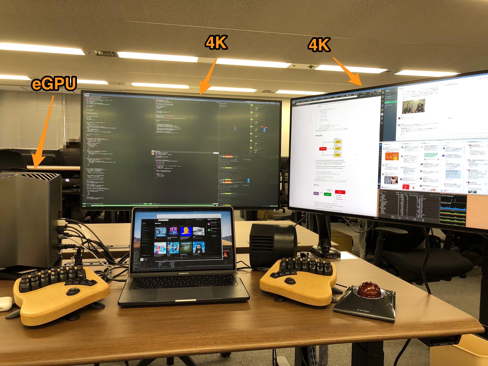

autoscale: true
slidenumbers: true
footer: UIT #5
Theme: Courier,7

[.slidenumbers: false]
[.hide-footer]
# ゆるふわに既存プロジェクトを*TypeScript*に移行してみた
## in UIT #5


---

# About me


- [@iwata](https://github.com/iwata)
- Software Engineer
	- 株式会社エスエムエス
- Vue歴約4年
	- Nuxt歴半年:beginner:
	- TypeScript歴1ヶ月:beginner::beginner:
- Editor: Vim(NeoVim)
- Terminal: [Alacritty](https://github.com/jwilm/alacritty)
	- A cross-platform, GPU-accelerated terminal emulator
- マイブーム:
	- [Blackmagic eGPU](https://www.blackmagicdesign.com/jp/products/blackmagicegpu/)
	- [Logicool Spotlight](https://www.logicool.co.jp/ja-jp/product/spotlight-presentation-remote) :new:

^ TSも初採用なんであんまり詳しくないです
そんな人でもTS移行できるYO

---
[.hide-footer]
[.slidenumbers: false]



---

# [fit] よろしくお願いします:innocent: 

---

# Agenda

- 移行方針
- Linterの話
- Componentの移行
- Testの移行

**Attention**

- `Nuxt`使ったので`@vue/cli`使っていると別のノウハウありそう
	- ただし`Nuxt`固有の話はでてきません[^1]

[^1]: `Nuxt`関連は[NuxtMeetup#6](https://nuxt-meetup.connpass.com/event/107759/)でLTします:bow:

---

# ゆるふわプロジェクト

- 社内ツール
- Nuxt(SSR)さわってみたかった
- GAE SE Nodeさわってみたかった
- Firebaseさわってみたかった

```sh
> cd project-dir
> fd -e vue ./ | wc -l
23
> fd -e js ./ | wc -l
59
```
^ Componentは23個しかない

---

# 移行方針:articulated_lorry:

---

# 移行方針

- 移行中は新規開発を停止
	- 開発者一人なんで:+1:
- 実際移行にかかったのは約4週間
	- 思考錯誤した結果:sweat:

^ 開発停止は普通だと受け入れられないと思うのでやり方考える必要ありそう
4weeksぐらいで移行した

---

# 移行する順序

1. components
	1. layouts, pages含む
1. utils, plugins, middleware, etc.
1. store
1. test

- testがあるのでtestが通ることを確認しつつ移行:green_heart:
	- 最後はtestも移行

---

# TS周りのlibrary追加

```sh
> yarn add vue-property-decorator vuex-class \
           vue-class-component nuxt-class-component
> yarn add -D typescript ts-loader
```

︙
ほか必要に応じて色々

---

# `tsconfig.json`

- `@vue/cli`でTSを有効にした場合に使われるものを雛形にする
	- [vue\-cli/tsconfig\.json](https://github.com/vuejs/vue-cli/blob/dev/packages/%40vue/cli-plugin-typescript/generator/template/tsconfig.json)
- 但し、`allowJs`だけ一時的にtrueに
	- JSファイルが混在するので、移行完了したらfalse
- `strict:true`なのでimplicit anyは弾く

---

# Linter

---

# Linter


- [Xo](https://github.com/xojs/xo)[^2]
	- `JavaScript happiness style linter`
	- ESlint configのいい感じ集(prettier連携とか)[^3]
- CIのlintは一旦offにする
- [lint-staged](https://www.npmjs.com/package/lint-staged)は`.vue`, `.ts`のみ有効 [^4]
	- JSのlintはこけるので:smiling_imp:

[^2]: 設定は`package.json`にしか書けない:innocent:

[^3]: [xojs/eslint\-config\-xo\-typescript](https://github.com/xojs/eslint-config-xo-typescript#use-with-xo)というのもある

[^4]: `override`がXoのせいかうまくいかず

^pug使ってるし、`eslint-plugin-vue`のうまみがいまのところないので、`tslint`使った方がよかった気がする.
prettierの相性はどうかわからないけど.

---

## Linter

```bash
> yarn add -D eslint-config-xo-typescript \
	eslint-plugin-typescript typescript-eslint-parser 
```

[.code-highlight: all]
[.code-highlight: 4,7,13]
```javascript
"xo": {
  "parser": "vue-eslint-parser",
  "parserOptions": {
    "parser": "typescript-eslint-parser"
  },
  "extends": [
    "xo-typescript",
    "plugin:vue/recommended",
    "plugin:jest/recommended"
  ],
  "extensions": [
  	"vue",
  	"ts"
  ]
︙
}
```

^ Xo使ってなくても`.eslint.js`に同様に書ける

---

# [fit] :rotating_light:Linterのハマりポイント:rotating_light:

---

# Linterのハマりポイント

- typescript-eslint-parser
	- TypeScriptをESTree互換の形に変換し、ESLintを適用できるようにするパーサがプラグイン[^5]
- eslint-plugin-typescript
	- TypeScriptの用のルール
- これらにいくつか罠がある

[^5]: [Vue \+ TypeScriptなプロジェクトにESLintを導入する](https://joe-re.hatenablog.com/entry/2018/01/02/230806)

---

## Lintのハマりポイント `no-unused-vars`

[\[no\-unused\-vars\] False positive for unused vars inside decorator arguments · Issue \#126 · bradzacher/eslint\-plugin\-typescript](https://github.com/bradzacher/eslint-plugin-typescript/issues/126)

[.code-highlight: all]
[.code-highlight: 6]
```typescript
import { Component, Vue } from 'vue-property-decorator';
import HelloWorld from './components/HelloWorld.vue';

@Component({
  components: {
    HelloWorld
  }
})
export default class App extends Vue {}
```

`error: 'HelloWorld' is defined but never used (no-unused-vars)`

---

# [fit]Decoratorの引数をみてくれない:sob:[^6]

[^6]: ちなみにEvan Youもレポートしてる: [False positive for unused vars inside decorator arguments · Issue \#445 · eslint/typescript\-eslint\-parser](https://github.com/eslint/typescript-eslint-parser/issues/445)

---

# [fit] Lintのハマりポイント `no-unused-vars`

rule追加:pray:

```javascript
"rules": {
	"no-unused-vars": "off"
}
```

- `tsconfig.json`の`noUnusedLocals`でいけるんじゃね?
- `tsc`が`<template></template>`内の参照をみてくれずにコンパイルエラーになる:joy:
	- `data`用に宣言したpropertyとかが使われてないってエラー
	- `TS6133: 'isActive' is declared but its value is never read.`

---

# Lintのハマりポイント `no-undef`

[Interface produces no\-undef errors · Issue \#437 · eslint/typescript\-eslint\-parser](https://github.com/eslint/typescript-eslint-parser/issues/437)

```typescript
interface Runnable {
  run(): Result
  toString(): string
}
```

```
./Runnable.ts
  1:11  error  'Runnable' is not defined  no-undef
  2:3   error  'run' is not defined       no-undef
  2:11  error  'Result' is not defined    no-undef

✖ 3 problems (3 errors, 0 warnings)
```

^ コードはissueにあがってるやつ

---

# [fit]型指定が軒並 `not defined`:sob:

---

# Lintのハマりポイント `no-undef`

> Namely, you can safely disable no-undef for .ts files because TypeScript will fail to compile with undefined vars. The rule is redundant.
-- [Kevin Cooper](https://github.com/eslint/typescript-eslint-parser/issues/437#issuecomment-435526531)

rule追加:pray:

```javascript
"rules": {
	"no-undef": "off"
}
```

---

# [fit] Lintのハマりポイント [`typescript/adjacent-overload-signatures`](https://github.com/bradzacher/eslint-plugin-typescript/blob/master/docs/rules/adjacent-overload-signatures.md)

`overload`の可読性を高めるためのルール
:arrow_down:こういうのを警告してくれる

```typescript
export function foo(s: string): void;
export function foo(n: number): void;
export function bar(): void;
export function foo(sn: string | number): void;
```

---

# [fit] Lintのハマりポイント typescript/adjacent-overload-signatures

[Unhandled exception in adjacent\-overload\-signatures · Issue \#49 · bradzacher/eslint\-plugin\-typescript](https://github.com/bradzacher/eslint-plugin-typescript/issues/49)

- いまのところ有効にしてると`eslint`自体実行できずにエラーになる
- ただしfixはされてるらしいのでリリースされたら使える

---

## [fit] Lintのハマりポイント `typescript/adjacent-overload-signatures`

rule追加:pray:

```javascript
"rules": {
	"typescript/adjacent-overload-signatures": "off"
}
```

---

# Lintのまとめ

- ESLintの以下のルールをoffにする
	- `no-unused-vars`
	- `no-undef`
	- `typescript/adjacent-overload-signatures`
- 罠多いのでTSLintの方がいいかも🤔
	- JSとの共存もし易そう

^ versionによって動いたり、動かなかったりするruleあるんで、CIでLintしつつ[Dependency management](https://github.com/marketplace/category/dependency-management)入れなれないとつらい

---

# Componentの移行

---

# Componentの移行

- なにわともあれ`vue-shims.d.ts`をおく[^7]
- `.vue`ファイルをimportする時に記述されているコードをTypeScriptとして認識させる

```typescript
declare module '*.vue' {
  import Vue from 'vue'
  export default Vue
}
```

[^7]: https://github.com/Microsoft/TypeScript-Vue-Starter#single-file-components

---

# `vue-convert`

Class styleにするため[vue\-convert](https://www.npmjs.com/package/vue-convert)を使って雛形を作る

```sh
> yarn global add vue-convert
> vue-convert -s class components/side-menu.vue
```

- できたファイルをdecoratorとかで書き直していくとだいぶショートカットできる
- compileが通って、testが通れば大体:ok_hand:

---

# Component Properties

`data`とか`@Prop`で使うpropertyでエラー

[.code-highlight: all]
[.code-highlight: 4,5]
```typescript
@Component
export default class SideMenu extends Vue {
  @Prop(String)
  path: string // ERROR
  isLoading: boolean // ERROR
}
```

---

# Component Properties

default値を設定するか`!`をつける[^8]

[^8]: [Property 'title' has no initializer and is not definitely assigned in the constructor](https://github.com/kaorun343/vue-property-decorator/issues/81)

```diff
@Component
export default class LoggedIn extends Vue {
  @Prop(string)
- path: string // ERROR
+ path!: string
- isLoading: boolean // ERROR
+ isLoading = false
}
```

---

# `$refs`の型定義

> ref は要素または子コンポーネントに参照を登録するために使用されます。参照は親コンポーネントの $refs オブジェクトのもとに登録されます。[^9]
-- *Vue official docs*

[^9]: https://jp.vuejs.org/v2/api/#ref

```html
<!-- vm.$refs.p は DOM ノード -->
<p ref="p">hello</p>
<!-- vm.$refs.child は child-component のインスタンス -->
<child-component ref="child"></child-component>
```

---

# `$refs`の型定義

NativeのDOM API使いときや特定要素を触りたいときに使う

[.code-highlight: all]
[.code-highlight: 3]
```typescript
setScrollPosition(position: number): void {
  const {preview} = this.$refs
  preview.scrollTo(0, position)
}
```

`Property 'scrollTo' does not exist...` っていわれる

---

# `$refs`の型定義

`$refs` propertyとして型定義する[^10]

[^10]: [add example of $ref casting to any in documentation · Issue \#94 · vuejs/vue\-class\-component](https://github.com/vuejs/vue-class-component/issues/94)

[.code-highlight: all]
[.code-highlight: 3-5]
```typescript
@Component
export default class MarkdownPreview extends Vue {
  $refs!: {	// `!`は必須
    preview: HTMLElement
  }
  setScrollPosition(position: number): void {
    const {preview} = this.$refs
    preview.scrollTo(0, position)
  }
}
```

---

# Event.targetの型指定

[.code-highlight: all]
[.code-highlight: 3]
```typescript
async onInput(event: Event) {
  this.isProcessing = true
  await this.$store.dispatch("update", event.target.value) // Error
  this.isProcessing = false
}
```

- `Property 'value' does not exist on type 'EventTarget'.`
- `target`がどのElement型なのか分からない[^11]

[^11]: [型定義](https://github.com/Microsoft/TypeScript/blob/master/src/lib/dom.generated.d.ts#L4972)だと`EventTarget | null`になっている

---

# Event.targetの型指定

- Eventが発火したElementに自分でキャスト
	- この場合は`input`要素なので`HTMLInputElement`

[.code-highlight: all]
[.code-highlight: 3,4]
```typescript
async onInput(event: Event) {
  this.isProcessing = true
  const target = event.target as HTMLInputElement
  await this.$store.dispatch("update", target.value)
  this.isProcessing = false
}
```

^"Typescript event target"とかでググると色々でてくる

---

# Tips

:arrow_down:みたいなファイルを作っておくとimport時に楽
`~/utils/vue-class.ts`

```typescript
import {Vue, Emit, Prop, Watch} from 'vue-property-decorator'
import Component from 'nuxt-class-component'
import {mixins} from 'vue-class-component'
import {State, Getter, Action, Mutation, namespace} from 'vuex-class'

export {
  Vue, Component, Emit, Getter, Prop, Watch,
  mixins, State, Mutation, Action, namespace
}
```

---
# import側

```typescript
<script lang="ts">
  import {Vue, Component, Props, State} from "~/utils/vue-class"
  @Component
  export default class Menu extends Vue {
  	︙
  }
</script>
```

---

# Componentの移行まとめ

- `property`は`!`をつけるかdefault値を設定する
- `$refs`は`property`として型定義する
- `Event.target`は自分でキャストする

--- 

# Testの移行

---

# `jest.config.js`


```sh
> yarn add -D ts-jest @types/jest
> yarn ts-jest config:migrate jest.config.js
# some advices
```

[.code-highlight: all]
[.code-highlight: 2,6,10,12]
```javascript
module.exports = {
  moduleFileExtensions: ['js', 'ts', 'vue'],	// 'ts'を追加
  moduleNameMapper: { '^~/(.*)$': '<rootDir>/$1' },
  transform: {
    '^.+\\.jsx?$': 'babel-jest',
    '^.+\\.tsx?$': 'ts-jest',
    '.*\\.vue$': 'vue-jest',
    '.+\\.(css|styl|less|sass|scss|png|jpg|ttf|woff|woff2)$': 'jest-transform-stub'
  },
  globals: { 'ts-jest': { tsConfig: 'tsconfig.json' } },
  snapshotSerializers: ['jest-serializer-vue'],
  preset: 'ts-jest/presets/js-with-babel'
}
```

^ Jest以外だとAVA, Mochaとか?

---

# [fit] `shallowMount/mount`時のComponentの型

- 例
	- `Hoge` Componentの`fuga()`メソッドの挙動をテストしたい

```typescript
const wrapper = shallowMount(Hoge)
wrapper.vm.fuga() // Error
// 型引数あり
const wrapper = shallowMount<Hoge>(Hoge)
wrapper.vm.fuga() // Error
```

---

# [fit] `shallowMount/mount`時のComponentの型

- `Hoge`をうまく型として認識してくれない
	- [vuetype](https://github.com/ktsn/vuetype)で型定義生成したいけど試したらエラーになった:tired_face:[^12]
- 仕方なく`any`にキャストして回避:innocent:

```typescript
const wrapper = shallowMount(Hoge)
const vm = wrapper.vm as any
vm.fuga()
```

[^12]: 自前で型定義書けばいけるけどさすがに面倒

^ Vue本体のissueで議論されてる(?)っぽいので将来改善されそう

---

# Vuex Actionsのtest

> Actions
> 1. Call with mocked store context, (payload)
> 2. Assert that action commits data
-- [Edd Yerburgh](http://slides.com/eddyerburgh/testing-a-vuex-store#/20)

- `context`をmockにしてUnit Testしたい
	- `commit`を`jest.fn()`でmockしたい

---

# type safeなActionsの例[^13]

[.code-highlight: all]
[.code-highlight: 8,11]
```typescript
import {ActionTree, ActionContext} from 'vuex'
export interface UserState {
  id: number
  name: string
  email: string
}
interface UserActions<S, R> extends ActionTree<S, R> {
  login(context: ActionContext<S, R>, payload: LoginPayload): Promise<void>
}
export const actions: UserActions<UserState, any> = {
  login({commit}, payload) {
  	...
  	commit('setUser', ...)
  }
}
```

`ActionContext`をtype safeにmockできればよい

[^13]: NuxtのModule mode想定のコード

^login actionをtestしたい.
TSでのVuexの書き方は流派?があるが、今回はofficialなVuexの型定義のみを用いた

---

# Vuex Actionsのtest

[.code-highlight: all]
[.code-highlight: 4-8,10]
```typescript
import {ActionContext} from 'vuex'
import * as store from '~/store/user'

const commit = jest.fn()
const MockContext = jest.fn<ActionContext<store.UserState, any>>(() => ({
  commit
}))
const context = new MockContext()
const payload = {...}
await store.actions.login(context, payload)
expect(commit).toHaveBeenCalledTimes(1)
expect(commit).toHaveBeenCalledWith('setUser', ...)
```

- `jest.fn()`に型を渡してその型を実装したMock Classを定義する[^14]
- `new`してMock Instanceを作ってactionsを実行

[^14]: jes.fn()の[型定義](https://github.com/DefinitelyTyped/DefinitelyTyped/blob/master/types/jest/index.d.ts#L110-L117)をみるとわかる

^TSのsyntaxhighlightがイマイチきかない…orz

---

# Test移行のまとめ

- Componentは妥協して`any`
- StoreのtestもMockを使って可能
- 型があるせいで気軽にMockを刺せないのでMock多用していると大変
	- 考え方によってはMockを多用させないという抑止力になるかも☺️

---

# Stats

**Before**

```bash
> fd -e js | wc -l
59
```

**After**

```bash
> fd -e js | wc -l
6
> fd -e ts | wc -l
62
```

`allowJS`も晴れて`false`に:tada:

---

# [fit] Vue TypeScriptの~~ツラミ~~ノウハウをシェアして<br>型安全な世界へ🤗

---

# ありがとうございました:clap::clap: